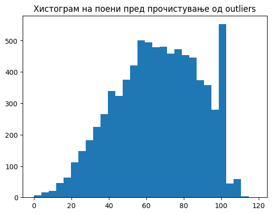
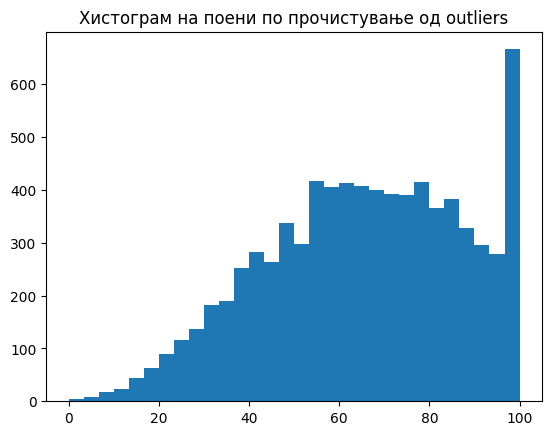
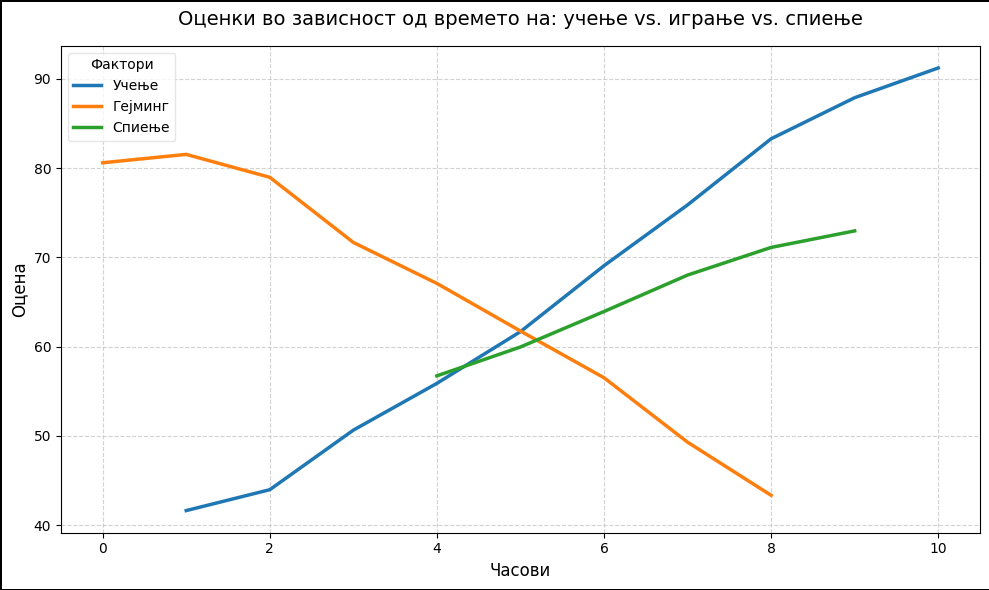
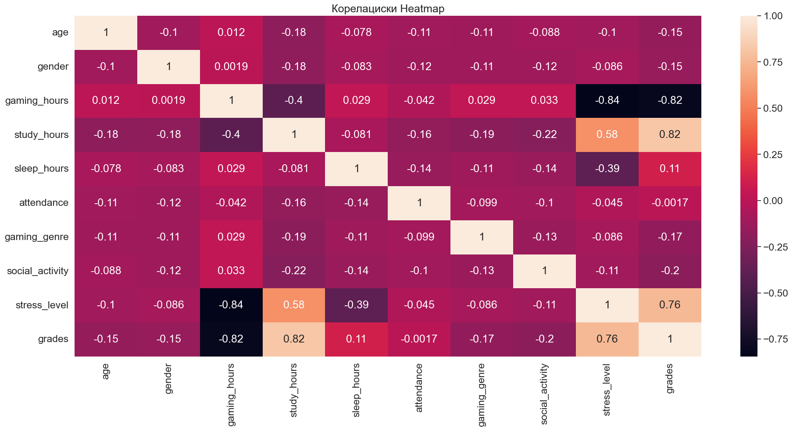
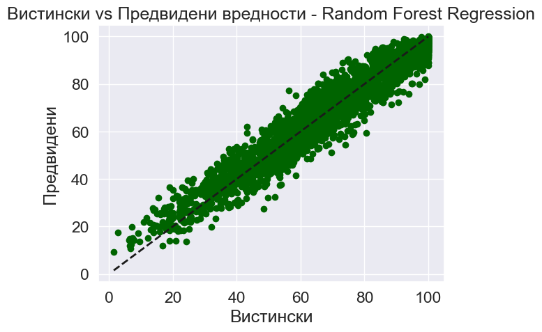
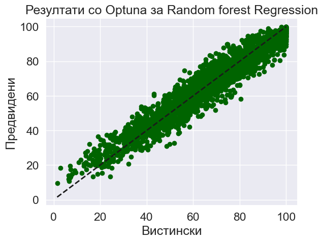

Gaming and Academic Performance Analysis
=========================================

This project looks into how playing video games affects student grades. The main goal was to build a model that can predict a student's score based on their daily habits — specifically how many hours they spend studying, sleeping, and gaming. We wanted to see which of these factors matters the most and whether we could make accurate predictions using machine learning.

The dataset contains 8,000 student records with 14 features, including things like age, gender, gaming hours, study hours, sleep hours, attendance, gaming genre, stress level, and of course the target variable — grades (scored from 0 to 100).


About the dataset
------------------

The data comes from a simulated dataset called `Gaming_Academic_Performance.csv`. Each row represents a single student and includes information about their lifestyle and habits. The features we worked with are:

- gaming_hours — how many hours per day the student plays games
- study_hours — how many hours per day they study
- sleep_hours — how many hours per day they sleep
- attendance — their class attendance rate
- stress_level — categorized as Low, Medium, or High
- gaming_genre — what type of games they play (FPS, RPG, Casual)
- gender, age, social_activity, and a few others


Data cleaning
-------------

Before doing anything else, we noticed that some students had grade values above 100, which does not make sense on a 0-100 scale. These were clearly outliers, so we removed them.

Here is the histogram of grades before cleaning:



And here is how it looks after we removed those outlier values:



You can see that the spike above 100 is gone, and the distribution looks much cleaner after that step.


Exploratory analysis — how gaming, studying, and sleeping affect grades
-----------------------------------------------------------------------

One of the most interesting parts of this project was visualizing the relationship between hours spent on different activities and the resulting grades. We grouped students by rounded hours of studying, gaming, and sleeping, and then plotted the average grades for each group.



What this chart shows is pretty clear:

- The more a student studies, the higher their grades tend to be. This is the blue line, and it goes up steadily from around 40 points at 0 hours to over 90 points at 10 hours of study.
- Gaming has the opposite effect. Students who game more tend to have lower grades. The orange line starts high (around 80 for students who barely game) and drops down to about 43 for those who game 8+ hours a day.
- Sleeping has a moderate positive effect. More sleep generally means slightly better grades, though the effect is not as strong as studying.

This confirmed our initial assumption — gaming hours and study hours are the two most important lifestyle factors when it comes to academic performance.


Correlation heatmap
-------------------

We also generated a correlation heatmap to see how all the features relate to each other and to the target variable (grades).



Looking at the last row (grades), the strongest correlations are:

- study_hours has a positive correlation of 0.82 with grades — the strongest predictor
- gaming_hours has a negative correlation of -0.82 — gaming a lot clearly hurts performance
- stress_level has a correlation of 0.76 with grades (after encoding)
- sleep_hours shows a smaller positive correlation of 0.11

Based on this, we used SelectKBest to pick the top 5 features: gaming_hours, study_hours, sleep_hours, attendance, and stress_level.


Model training and comparison
-----------------------------

We trained several regression models to predict student grades and compared them using standard error metrics. Here are the results after feature selection:

| Model               | MAE    | MSE     | RMSE   | R2     |
|---------------------|--------|---------|--------|--------|
| Linear Regressor    | 5.19   | 42.85   | 6.55   | 0.9096 |
| Polynomial Degree 2 | 4.73   | 35.26   | 5.94   | 0.9256 |
| Decision Tree       | 6.45   | 69.64   | 8.35   | 0.8531 |
| Random Forest       | 4.68   | 35.47   | 5.96   | 0.9252 |
| KNN Regressor       | 5.25   | 44.29   | 6.66   | 0.9066 |
| Dummy Regressor     | 18.00  | 474.19  | 21.78  | -0.000 |

Random Forest stood out as one of the best performing models right from the start. It had the lowest MAE and was very competitive on all other metrics.

Here is the scatter plot showing actual vs. predicted values for Random Forest:



The points cluster tightly around the diagonal line, which means the model's predictions are close to the actual grades.


Hyperparameter optimization
----------------------------

Since Random Forest gave us the best results, we decided to push it further with hyperparameter tuning. We tried two approaches:

First, we ran a Randomized Search Cross Validation, testing 100 different parameter combinations across 3 folds. This brought the error down slightly:

| Model         | MAE    | MSE     | RMSE   | R2     |
|---------------|--------|---------|--------|--------|
| Random Forest | 4.65   | 34.81   | 5.90   | 0.9266 |

Then we also tried Optuna, which is a more advanced hyperparameter optimization framework. It found a configuration that reduced the MAE even further:

| Model         | MAE    | MSE     | RMSE   | R2     |
|---------------|--------|---------|--------|--------|
| Random Forest | 4.65   | 35.07   | 5.92   | 0.9260 |

Here is the final scatter plot after optimization with Optuna:



The results are very similar between the two optimization methods, but both represent an improvement over the default Random Forest. In the end, we went with Random Forest as our final model because it consistently had the best performance across all the experiments we ran.


Why Random Forest
-----------------

We tested six different models, and Random Forest came out on top every time. It handled the data well without overfitting (unlike Decision Tree), it was more accurate than simpler models like Linear Regression and KNN, and after hyperparameter tuning it achieved an R2 score of about 0.927 — meaning it explains roughly 93% of the variance in student grades.


How to install and run
----------------------

1. Clone this repository:

```
git clone https://github.com/timko332/Gaming_Academic_Performance.git
cd Gaming_Academic_Performance
```

2. Create a virtual environment (optional but recommended):

```
python -m venv .venv
.venv\Scripts\activate
```

3. Install the required packages:

```
pip install pandas numpy matplotlib seaborn scikit-learn optuna jupyter
```

4. Start Jupyter Notebook:

```
jupyter notebook
```

5. Open the file `Analiza-na-vlijanieto-na-igranjeto-videoigri-JupyterTetratka.ipynb` and run the cells from top to bottom. The dataset `Gaming_Academic_Performance.csv` is included in the repository, so everything should work out of the box.
